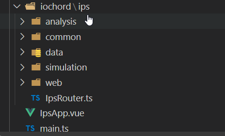
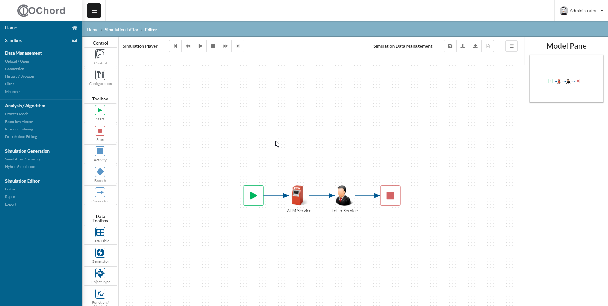

# Simulation editor

## A. Folder Structure
1. All modules is located within `iochord/ips` folder and is structured according to the menu of the UI e.g. `analysis` folder is for the Analysis/Algorithm page, `data` is for the Data Management page. Exception for `common` folder which contains the submodule (that might be) reused within multiple pages.




## B. Load model

1. Go to [SimulationEditorView.vue](https://gitserver.dev.iochord.co.kr:4443/natanael_yabes/tips-simulation2019_development/blob/develop/ips/ips-simulator-web/src/main/ts/src/iochord/ips/simulation/editor/views/SimulationEditorView.vue)

2. Under `public async mounted(): Promise<void>` method, inspect the following code:
```typescript
if (graphModule.graph.getVersion === undefined) {

  // Fetch graph to Vuex state
  await this.modelCreate();     // Initialize new graph

  // Print to stdout
  console.log(graphModule.graph);
}
```

3. `this.modelCreate()` is a method within `SimulationEditorView.vue` to create new simulation model and store it within vuex store. The `this.forceReRender()` method is used to reload canvas component whenever users visit the `SimulationEditorView.vue` page
```typescript
/**
 * To create new simulation model.
 *
 * @memberof SimulationEditorView
 */
public async modelCreate() {

  // Create simulation model and store in the vuex store.
  await graphModule.newGraph();

  // Reload canvas component.
  this.forceReRender();
}
```

4. After these methods were called, the graph data was stored in `graphModule.graph`. The `public get graphData(): Graph | undefined` simply returns this graph module object such that it may be accessed within Vue template.
```typescript
/**
 * Returns the graph data object.
 *
 * @readonly
 * @type {(Graph | undefined)}
 * @memberof SimulationEditorView
 */
public get graphData(): Graph | undefined {
  return graphModule.graph;
}
```

5. Then, within the same file, in the Vue template, the graphData can be use as an input to the CanvasComponent.
```html
<!--
  @package ips
  @author Natanael Yabes Wirawan <yabes.wirawan@gmail.com>
  @since 2019
-->
<template>

  ...

  <!-- Content -->
  <template slot="content">
    <CanvasComponent :isDisabled="isDisabled" :key="reRenderKey" v-bind:response="graphData" />
  </template>

  <template slot="right-sidebar-menu-item">
    <MinimapComponent v-bind:response="graphData" />
  </template>

  ...

</template>
```
6. Go to [CanvasComponent.vue](https://gitserver.dev.iochord.co.kr:4443/natanael_yabes/tips-simulation2019_development/blob/develop/ips/ips-simulator-web/src/main/ts/src/iochord/ips/simulation/editor/components/canvas/CanvasComponent.vue)

7. Inspect the `response` field. This field accepts the graphData object so that it can be accessed within `CanvasComponent.vue`
```typescript
/**
 * Response from the web service as the graph JSON object.
 *
 * @type {Graph}
 * @memberof CanvasComponent
 */
@Prop() public response?: Graph;
```

8. Focus on the `public loadGraph(): void` method. This method is used to load graphData from the `this.response` field.
```typescript
/**
 * Load graph into canvas.
 *
 * @memberof CanvasComponent
 */
public loadGraph(): void {
  try {

    // Deserialize the model
    this.graph = this.response as Graph;

    // TODO: we can choose any rendering engine later
    const renderer = new JointJsRenderer(
      this.graph,
      this.activePage as GraphPage,
      this.currentSelectedElement as GraphNode,
      this.isProcessModel as boolean,
    );

    // Get panAndZoom instance from renderer
    this.panAndZoom = renderer.panAndZoom;

    // 'Listening to events' can only be done after all components were rendered
    renderer.jointPages.forEach((jointPage: JointGraphPageImpl) => {
      this.whileListenToEvents(jointPage);
    });

    // Set active page to the first page of the graph
    if (this.graph) {
      this.activePage = this.graph.getPages()!.get('0');
    }

    // Assign Joint.js page as an active page
    if (this.activePage) {
      this.activePage = renderer.activeJointPage(this.activePage.getId() as string) as JointGraphPageImpl;
    }
  } catch (e) {
    // console.error(e);
  }
}

```

9. The `JointJsRenderer` is used to render the graph into HTML canvas element identified with id of `canvas`
```typescript
<div id="canvas"
  @keydown.esc = "handleEscapeButton($event)"
  @mousedown = "handleCanvasMouseDown($event)"
  @mousemove = "handleCanvasMouseMove($event)"
  @mouseup   = "handleCanvasMouseUp($event)" />
```

10. The `this.whileListenToEvents(jointPage)` is called so that the Joint.js canvas be able to listen to user events e.g. what would happened when user click on a blank canvas or an element.

```typescript
// 'Listening to events' can only be done after all components were rendered
renderer.jointPages.forEach((jointPage: JointGraphPageImpl) => {
  this.whileListenToEvents(jointPage);
});
```

11. Example of joint.js event listener, invoked when user double clicked any node element.

```typescript
/**
 * Listen to Joint.js canvas events.
 *
 * @private
 * @param {JointGraphPageImpl} jointPage
 * @memberof CanvasComponent
 */
private whileListenToEvents(jointPage: JointGraphPageImpl): void {

  ...

  jointPage.getPaper().on({

    ...

    'element:pointerdblclick': (elementView: joint.dia.ElementView) => {

      if (this.isDisabled) {
        return;
      }

      // Reset page
      resetAll(jointPage.getPaper());

      // Get current element and its properties
      const currentElement = elementView.model;
      const currentElementType: string = currentElement.attributes.type;
      const currentElementCategory: string = currentElement.attributes.category;

      // Get node property
      let property;
      let currentElementId: string;

      // Get element properties
      if (currentElementCategory === 'node') {
        currentElementId = currentElement.attributes.nodeId.split('-')[2];
        property = graphModule.pageNode(jointPage, currentElement.attributes.nodeId);
      } else if (currentElementCategory === 'data') {
        currentElementId = currentElement.attributes.dataId.split('-')[2];
        property = graphModule.pageDatum(jointPage, currentElement.attributes.dataId);
      }

      if (!this.isProcessModel) {

        // Populate modal with element properties
        (this.$refs[currentElementType] as Modal<JointGraphPageImpl, typeof property>).populateProperties(jointPage, property);

        // Show modal
        $(`#${currentElementType}`).modal('setting', 'transition', 'fade up').modal('show');
      }
    },

    ...

  });

  ...

}
```
